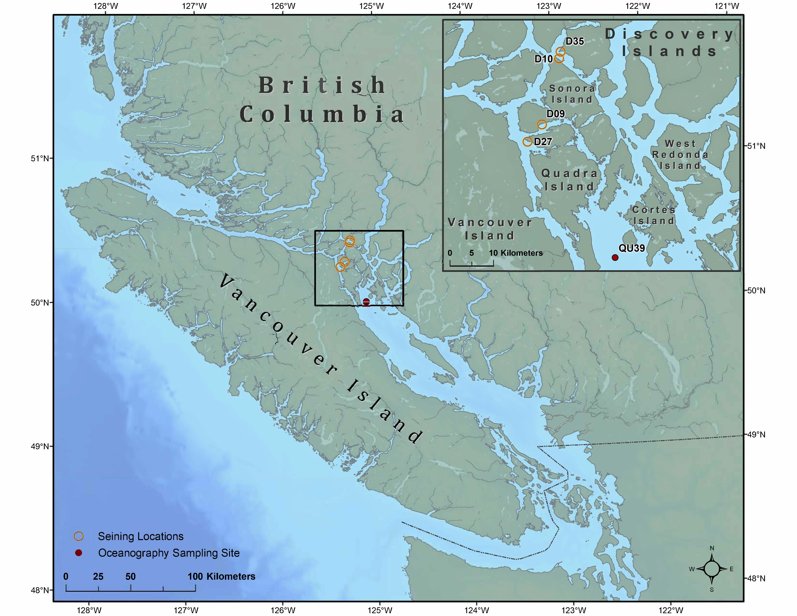

\begin{center}
\large
— Hakai Institute Juvenile Salmon Program 2022 —
\end{center}


```{r setup, include = FALSE}
knitr::opts_chunk$set(echo = FALSE, warning=FALSE, message=FALSE, error=FALSE)
library(tidyverse)
library(lubridate)
library(here)
library(googlesheets4)
library(ggridges)
library(hakaiApi)
library(hakaiR)
options(scipen=999) # This removes scientific notation for inline output ie `r object` in the report text
theme_set(hakaiR::hakademic_theme(base_size = 17))

field_data_url <- "https://docs.google.com/spreadsheets/d/1ezxMrD7g-0ExabJv6mLWg4gPthOSiEyLo5vi-D-BGxI/edit#gid=0"

sites <- read_csv("https://raw.githubusercontent.com/HakaiInstitute/jsp-data/master/supplemental_materials/tidy_data/sites.csv")

spp_labels <- c(HE = "Herring", CU = "Chum", PI = "Pink", SO = "Sockeye", DI = "Discovery Islands")

# Run ctd_data_import_and_wrangle_2022.R 
#source(here("2022_in_season_report", "ctd_data_import_and_wrangle_2022.R"))
temperature_anomaly_data <- read_csv(here("2022_in_season_report", "data", "temperature_anomaly_data.csv"))
average_temps <- read_csv(here("2022_in_season_report", "data", "average_temps.csv"))
qu39_this_year <- read_csv(here("2022_in_season_report", "data", "qu39_this_year.csv"))

survey_seines_GH <- read_csv("https://raw.githubusercontent.com/HakaiInstitute/jsp-data/master/supplemental_materials/report_data/survey_seines.csv") |> 
  mutate(sampling_week = as.numeric((yday(survey_date) + 4) %/% 7)) |> 
  left_join(select(sites,
                   site_id,
                   region))


survey_seines_GH$sampling_week <-
  recode_factor(
    survey_seines_GH$sampling_week,
    `18` = "May 5",
    `19` = "May 12" ,
    `20` = "May 19",
    `21` = "May 26",
    `22` = "June 2",
    `23` = "June 9",
    `24` = "June 16",
    `25` = "June 23",
    `26` = "June 30",
    `27` = "July 6",
    `28` = "July 13",
  )

# Run first line independently so you can interactively enter authentication url in the console

surveys_2022 <- read_sheet(field_data_url, sheet = "survey_data") |> 
  drop_na(survey_id) |> 
  mutate(sampling_week = as.numeric((yday(survey_date) + 4) %/% 7))

1

surveys_2022$sampling_week <- recode_factor(surveys_2022$sampling_week, 
                                           `18` = "May 5",
                                           `19` = "May 12" ,
                                           `20` = "May 19", 
                                           `21` = "May 26",
                                           `22` = "June 2",
                                           `23` = "June 9", 
                                           `24` = "June 16", 
                                           `25` = "June 23",
                                           `26` = "June 30", 
                                           `27` = "July 6", 
                                           `28` = "July 13")

seines_2022 <- read_sheet(field_data_url, sheet = "seine_data") |> 
  drop_na(seine_id)

ss_2022 <- left_join(surveys_2022, seines_2022, by = "survey_id") |> 
  left_join(select(sites, site_id, zone), by = "site_id") |> 
  mutate(year = year(survey_date)) |> 
  drop_na(survey_id)

fish_field_2022 <- read_sheet(field_data_url, sheet = "fish_field_data") |> 
  drop_na(ufn) |> 
  mutate(region = "DI")

ss_fish_2022 <- left_join(fish_field_2022, ss_2022)

n_seasons <- max(year(ss_2022$survey_date) - 2015) + 1

```

## Aim 

To provide a rapid interim summary of juvenile salmon migration characteristics and oceanographic conditions in the Discovery Islands and northern Strait of Georgia region in British Columbia, Canada. 

## Background

The Hakai Institute Juvenile Salmon Program was launched in the spring of 2015. For a complete background including methods see [Hunt et al. 2018](https://npafc.org/wp-content/uploads/Public-Documents/2018/1788Canada.pdf). The program operates in the Discovery Islands (Figure 1) and thus provides information on the health of juvenile salmon after passage through: 

1) Strait of Georgia – stratified high plankton biomass zone; and 

2) Discovery Islands – highly-mixed low-plankton-biomass zone, and area of, historically, high potential for wild-farmed fish interactions.

## Program Objectives

1) Determine migration timing and relative abundance; 

2) Map migration habitat - oceanographic conditions along the migration route;

3) Understand the dynamics of the plankton food-webs that underpin juvenile salmon growth and health;

4) Understand parasite and pathogen infection dynamics and their impact on juvenile salmon growth and health.

## Key Parameters Reported

* Catch Statistics
* Lengths
* Parasite Loads

For questions/comments please contact brett.johnson@hakai.org and b.hunt@oceans.ubc.ca

The following plots are subject to change as the underlying data are preliminary and subject to further quality assurance. The Hakai Institute embraces an "Open Science Policy"; to that end you can access the time series data used in this report at http://dx.doi.org/10.21966/1.566666.



\newpage

# Migrtation Timing

We have captured very few sockeye so far this season, so it is not feasible to calculate migration timing for sockeye as done in previous years.

Table 1. Summary of sampling events conducted in 2022 in the Discovery Islands and totals of sockeye, pink, and chum salmon caught. Note NA indicates the net was not set.

```{r}
ss_2022 |> 
  select(`Survey Date`= survey_date, `Site ID` = site_id, Site = site_name, Sockeye = so_total, Pink = pi_total, Chum = cu_total) |> 
  knitr::kable()
```


```{r rolling mean ts v current, fig.cap = "Purse seine catches of juvenile sockeye (bars) and rolling seven day averages (lines) in 2022 compared to catches averaged by day across all years in the Hakai Juvenile Salmon Program time series from 2015-2021.", include = FALSE}
df22 <- select(ss_2022, date = survey_date, so_total) |> 
  mutate(group = "2022")

dfall <- select(survey_seines_GH, survey_date, so_total) |> 
  group_by(survey_date) |> 
  summarize(so_total = mean(so_total)) |> 
   mutate(year = 2022, # This is a trick to get the averages to compute for the same day between years
         month = month(survey_date),
         day = day(survey_date),
         date = as_date(paste(year,month,day,  sep = "-"))) |> 
  group_by(date) |> 
  summarize(so_total = mean(so_total)) |> 
  mutate(group = "2015-2021") |> 
  ungroup()

ss_all <- bind_rows(df22,dfall)

ss_all |> 
  mutate(seven_avg= zoo::rollmean(so_total, 5,
                             fill=NA)) |>
   ggplot(aes(x=date,
             y=so_total)) +
  geom_bar(aes(fill = group), alpha = .35, stat = "identity", position=position_dodge())+
  geom_line(aes(y = seven_avg, group = group, colour = group), 
            size = .75) +
  ylab("Sockeye catch") +
  xlab("Date") +
  theme(legend.title=element_blank()) +
  theme(legend.justification=c(1,1), legend.position=c(1,1)) 
  

```

## Catch Intensity 

```{r catch_intensity, fig.cap = "The catch intensity (average number of species i when i > 0 and when sockeye were also caught) of sockeye, pink, and chum salmon in the Discovery Islands. Numbers under each bar indicate the number of seines in which sockeye were caught, and error bars indicate 1 standard error."}

catch_intensity_22 <- ss_2022 |>
  rename("Sockeye" = "so_total", "Pink" = "pi_total", "Chum" = "cu_total") |>
  # remove seines that did not catch any sockeye, even if they caught other spp
  filter(Sockeye > 0) |> 
  select(year, Sockeye, Pink, Chum) |> 
  gather(key = species, value = catch, - year) 

# |> 
#   # Filter out catches where no pink and chum were caught, so that catch intensity is consistent for each species. Ie. catch intensity for sockeye is the average number of sockeye when catch of sockeye is > 0, catch intensity of pink is the average number of pink caught when > 1 pink was caught, and so on for chum as well.
#   filter(catch > 0)

catch_intensity_22 <- catch_intensity_22 |> 
  group_by(year, species) |> 
  summarize(mean_catch = mean(catch),
            sd = sd(catch),
            n = n())|> 
  mutate(se = sd / sqrt(n),
         lower_ci = qt(1 - (0.05 / 2), n - 1) * se,
         upper_ci = qt(1 - (0.05 / 2), n - 1) * se) |> 
  ungroup() |> 
  mutate_if(is.numeric, round, 1)


# Time series catch intensity
catch_intensity <- read_csv("https://raw.githubusercontent.com/HakaiInstitute/jsp-data/master/supplemental_materials/report_data/catch_intensity.csv")

catch_intensity <- bind_rows(catch_intensity, catch_intensity_22)

catch_intensity$species <- catch_intensity$species |>
  fct_relevel("Sockeye", "Pink", "Chum")

(ggplot(catch_intensity, aes(x = factor(year), y = mean_catch, fill = species)) +
  geom_bar(colour = "black",  stat="identity", position=position_dodge()) +
  geom_errorbar(aes(ymin = mean_catch - se, ymax = mean_catch + se),
                    width = 0.2,
                    position = position_dodge(0.9)) +
  geom_text(aes(y = 0.0, label = paste0(n)), size = 3.15, vjust = 1.25,
                position = position_dodge(0.9)) +
  xlab("Year") +
  ylab("Catch Intensity") +
  labs(fill = "Species") +
  scale_fill_manual(values = hakaiR::hakai_palette("hakai_salmon")))
```

## Species Proportion 

```{r species_proportion, fig.cap = "Proportion of juvenile salmon species caught in the Discovery Islands from 2015-2022." }

species_prop_2015_2021 <- read_csv("https://raw.githubusercontent.com/HakaiInstitute/jsp-data/master/supplemental_materials/report_data/proportion.csv")


species_prop_2022 <- ss_2022 |>
 select(
    survey_date,
    seine_id,
    so_total,
    pi_total,
    cu_total,
    co_total,
    he_total
  ) |>
  # Next I remove instances when no sockeye were caught. I'm doing this because in 2015 and 2016 we only enumerated catches in which we caught sockeye, whereas in 2017 and 2018 we enumerated all seines. So to reduce the bias introduced from the field method i filter the comparison down to where field methods are comparable
  filter(so_total > 0) |>
  # remove instances when not all species were enumerated by droping rows with NA
  drop_na() |>
  mutate(year = year(survey_date)) |>
  gather(
    `so_total`,
    `pi_total`,
    `cu_total`,
    `co_total`,
    `he_total`,
    key = "species",
    value = "n"
  ) |>
  drop_na()

spp_prop_expanded <-
  species_prop_2022[rep(row.names(species_prop_2022), species_prop_2022$n), 1:5] |>
  mutate(yday = yday(survey_date), year = year(survey_date))

species_prop_2022 <- spp_prop_expanded |>
  group_by(year, species) |>
  summarize(n = n()) |>
  mutate(proportion = n / sum(n)) |>
  ungroup()

# Combined proportions from 2015 - 2022, Discovery Islands
species_prop_total <- bind_rows(species_prop_2015_2021, species_prop_2022)

species_prop_total$species <- species_prop_total$species |> 
  fct_relevel("so_total", "pi_total", "cu_total", "co_total", "he_total") |> 
  fct_recode("Sockeye" = "so_total", "Pink" = "pi_total", "Chum" = "cu_total", "Coho" = "co_total",
             "Herring" = "he_total")

# Plotting this in a stacked bar graph: 
species_prop_total_graph <-  
  ggplot(data = species_prop_total, aes(x = year, y = proportion, fill = species)) +
      geom_bar(colour = "black", stat="identity", position = 'stack') +
      xlab("Year") +
      ylab("Proportion") +
      scale_fill_manual(values = hakai_palette("hakai_salmon")) +
      labs(fill = "Species") +
      scale_x_continuous(n.breaks = n_seasons)
  
  
species_prop_total_graph
```

## Fish lengths

```{r fish lengths, fig.cap = "Fork-length boxplots of juvenile salmon in the Discovery Islands in 2022 grouped by week, and represented by the middle day of each week, compared to all lengths from 2015-2021."}

length_histo <-
  read_csv(
    "https://raw.githubusercontent.com/HakaiInstitute/jsp-data/master/supplemental_materials/report_data/length_histo.csv"
  ) |>
  mutate(sampling_week = as.numeric((yday(survey_date) + 4) %/% 7))

length_histo$sampling_week <- recode_factor(length_histo$sampling_week, 
                                           `18` = "May 5",
                                           `19` = "May 12" ,
                                           `20` = "May 19", 
                                           `21` = "May 26",
                                           `22` = "June 2",
                                           `23` = "June 9", 
                                           `24` = "June 16", 
                                           `25` = "June 23",
                                           `26` = "June 30", 
                                           `27` = "July 6", 
                                           `28` = "July 13")
  
annual_di_length_histo <- length_histo |> 
  select(sampling_week, survey_date, region, species, fork_length) |> 
  filter(species %in% c("SO", "PI", "CU"),
         sampling_week %in% c("May 19", "May 26", "June 2", "June 9", "June 16", "June 23", "June 30", "July 6")) |> 
  mutate(year = "2015-2021",
         fork_length = as.numeric(fork_length))

di_length_histo_2022 <- ss_fish_2022 |> 
  select(sampling_week, survey_date, region, species, fork_length = fork_length_field) |> 
  filter(species %in% c("SO", "PI", "CU"), region == "DI") |> 
  filter(fork_length != "NA") |> 
  mutate(year = "2022",
         fork_length = as.numeric(fork_length))

di_length_histo <- bind_rows(di_length_histo_2022, annual_di_length_histo)

di_length_hist_plot <- ggplot(di_length_histo, aes(x = sampling_week, y = fork_length, fill = year)) +
  geom_boxplot()+
  ylab("Fork Length (mm)")+
  xlab("Date")+
  theme(legend.text = element_text(colour="black", size = 12)) + 
  theme(axis.text=element_text(size=12),
        axis.title=element_text(size=12,face="bold")) +
  facet_grid(species~., labeller=labeller(species = spp_labels))+
  theme(axis.text.x = element_text(angle = 45, vjust = 0.5))+
  scale_fill_manual(values = hakaiR::hakai_palette("Darjeeling1")) + 
  coord_cartesian(ylim = c(50,170))
  
di_length_hist_plot
```

\newpage


## Parasite Loads

In 2022 we resumed enumerating sea lice in the field using hand lenses to identify both attached (juvenile) and motile (adult) sea lice (Krkosek et al. 2005), after switching in 2020 to enumerating only motile sea lice under a dissecting microscope in the lab. As a result, our time series for attached stage lice excludes 2020 and 2021 for all species of salmon. We have also historically prioritized counting sea lice on sockeye, and given the low number of sockeye captured in 2022, here we report sea lice data for chum salmon only for this year thus far. We present data for abundance and prevalence of attached + motile lice for 2017, 2019 and 2022, and motile lice only for 2015-2022. 

### Definitions[^1] 

_Abundance_: The total number of individuals of a particular parasite species in a sample of hosts ÷ Total number of individuals of the host species in the sample (Average number of lice per fish).

_Prevalence_: Number of individuals of a host species infected with a particular parasite species ÷ Number of hosts examined (Proportion of fish infeccted with lice).

[^1]: Margolis, L., Esch, G.W., Holmes, J.C., Kuris, A.M. and Schad, G.A. (1982). The use of ecological terms in parasitology: report of an ad hoc committee of the American Society of Parasitologists. J. Parasitol. 68:131–133.


```{r wrangle attached stage data, include = FALSE}

# In 2017 we loused and retained 10 sockeye from the first set, and then conducted another set to louse 10 sockeye, 10 pink and 10 chum. Fish from the second set were anesthetized, live-liced and released (unless we hadn't hit quota from the first set in which case some fish were retained)

# In 2018 we didn't do attached stage licing in the field on pink or chum. only 10 sockeye. So, do we have any attached stage lice data from the lab in 2018??? - No, it appears not

# In 2019 we field liced (including attached stages) 10 sockeye, and only 3 pink and 3 chum from every seine

catch_data <- read_csv("https://raw.githubusercontent.com/HakaiInstitute/jsp-data/master/jsp_catch_and_bio_data_complete.csv") |> left_join(sites, by = "site_id")

# build table for attached stage lice

# Read in current year lice data
current_lice <- read_sheet(field_data_url, sheet = "sealice_field_data") |> 
# Join sea lice data to seine and survey_data by ufn and seine id
  right_join(ss_fish_2022, by = c('ufn', 'seine_id')) |> 
# select relevant columns and all sea lice counts
  select(survey_date, seine_id, ufn, species, lep_cope, lam, laf, lgf, cal_cope, cam, caf, cgf,
         chal_a_b, unid_cope, unid_chal) |> 
# Get rid of fish that were not loused
    drop_na() |> 
# Calculate total leps and cals to get ratio to infer to chalimus stages
  mutate(leps = lep_cope + lam + laf + lgf,
         cal = cal_cope + cam + caf + cgf,
         unk = chal_a_b + unid_cope + unid_chal,
         ratio = sum(leps, na.rm = TRUE) / sum(cal, na.rm = TRUE),
         inferred_leps = unk * ratio,
         inferred_cal = unk * (1-ratio)) |>
# Remove intermediate cols
  select(survey_date, seine_id, ufn, species,lep_cope, lam, laf, lgf, cal_cope,
         cam, caf, cgf, inferred_leps, inferred_cal) |> 
# Make 1 row an observation of one louse
  pivot_longer(cols = lep_cope:inferred_cal, names_to = "louse_species", values_to = "count") |> 
# Assign stages
  mutate(life_stage = if_else(louse_species %in% c("cal_cope", "lep_cope", "inferred_leps", "inferred_cal"), "attached", "motile"),
# Assign species
         louse_species = if_else(louse_species %in% c("cal_cope", 
                                                      "inferred_cal", "cam",
                                                      "caf", "cgf"), 
                                 "Caligus clemensi",
                                 "Lepeophtheirus salmonis")) |> 
# Total up all sea lice by fish, louse species and lifestage
  group_by(survey_date, seine_id, species, ufn, louse_species, life_stage) |> 
  summarize(count = sum(count)) |> 
  ungroup() |> 
  mutate(origin = "current_lice")

# import time series attached stage lice

# first read in sealice lab finescale
sealice_lab_fs <- read_csv("https://raw.githubusercontent.com/HakaiInstitute/jsp-data/master/supplemental_materials/raw_data/sample_results/sealice/sealice_lab_fs.csv") |>
# Join to catch data only by UFN 
  left_join(catch_data, by = c("ufn")) |> 
# Include only fish from Discovery Islands
  filter(region == "DI") |> 
# Make one row equal to one louse observation
  pivot_longer(cols = lep_cop:cal_mot_unid, names_to = "louse_species", values_to = "count") |> 
  drop_na(count) |>
  select(survey_date, seine_id, ufn, species, louse_species, count) |> 
# name louse stage based on original columns
  mutate(life_stage = if_else(louse_species %in% c("lep_cop", "lep_cunifer_cop", "lep_chal_a", "lep_chal_b", "cal_cop", "cal_chal_a_1", "cal_chal_a_2", "cal_chal_b_3", "cal_chal_b_4_f", "cal_chal_b_4_m", "cal_chal_4_unid", "cal_chal_a_unid", "cal_chal_b_unid"), "attached", "motile"),
    louse_species = if_else(louse_species %in% c("lep_cop", "lep_cunifer_cop", "lep_chal_a", "lep_chal_b", "lep_pa_m_1", "lep_pa_m_2", "lep_pa_f_1", "lep_pa_f_2", "lep_pa_unid", "lep_a_m", "lep_a_f", "lep_grav_f"), "Lepeophtheirus salmonis", "Caligus clemensi")) |> 
  group_by(survey_date, seine_id, species, ufn, louse_species, life_stage) |> 
  summarize(count = sum(count)) |> 
  ungroup() |> 
#Remove motile sealice because those observations are included in lab_mots_ts
  filter(life_stage == "attached") |> 
  mutate(origin = "sealice_lab_fs")

# second, read in time series lice data
#need to attach seine number first
seine_ids <- catch_data |> 
  select(seine_id, ufn)
lab_mots_ts <- read_csv("https://raw.githubusercontent.com/HakaiInstitute/jsp-data/master/supplemental_materials/report_data/sealice_time_series.csv") |> 
  filter(region == "DI", 
         year == year(survey_date),
         !louse_species == "all_lice") |> 
  mutate(louse_species = if_else(louse_species == "motile_caligus", "Caligus clemensi", "Lepeophtheirus salmonis" ),
         life_stage = "motile") |> 
  left_join(seine_ids, by = 'ufn') |> 
  select(survey_date, seine_id, species, ufn, louse_species, life_stage, 
         count = n_lice) |> 
  mutate(origin = "lab_mots_ts")


# Third read in the field data to pull out 
sealice_field <- read_csv("https://raw.githubusercontent.com/HakaiInstitute/jsp-data/master/supplemental_materials/raw_data/sample_results/sealice/sealice_field.csv") |> 
# Join to catch data just by ufn
  left_join(catch_data, by = 'ufn') |>
  filter(region == "DI") |> 
  mutate(year = year(survey_date)) |> 
  mutate(leps = lep_cope_field + lpam_field + lpaf_field + lam_field +
         laf_field + lgf_field,
         cal = cal_cope_field + cal_mot_field + cgf_field,
         unk = chal_a_field + chal_b_field + unid_cope_field + 
           unid_chal_field) |>
  select(seine_id, survey_date, ufn, year, species,
         cal_cope_field:unid_chal_field, leps, cal, unk) |> 
  group_by(year) |> 
  mutate(ratio = sum(leps, na.rm = TRUE) / sum(cal, na.rm = TRUE)) |> 
  ungroup() |> 
  mutate(inferred_leps = unk * ratio,
         inferred_cal = unk * (1-ratio)) |> 
  select(-c(year, unk, ratio, leps, cal, chal_a_field, chal_b_field, unid_cope_field, unid_chal_field)) |> 
  pivot_longer(cols = cal_cope_field:inferred_cal, 
               names_to = "louse_species", values_to = "count") |> 
  drop_na(count) |> 
  mutate(life_stage = if_else(louse_species %in% c("cal_cope_field", "lep_cope_field", "inferred_leps", "inferred_cal"), "attached", "motile"),
         louse_species = if_else(louse_species %in% c("cal_cope_field", "cal_mot_field", "inferred_cal", "cgf_field"), "Caligus clemensi", "Lepeophtheirus salmonis"))|> 
  group_by(survey_date, seine_id, species, ufn, louse_species, life_stage) |> 
  summarize(count = sum(count)) |> 
  filter(life_stage == "attached") |> 
  mutate(origin = "sealice_field")

#TODO: Include 2020 and 2021 motile counts from the lab
#TODO: combine lab and field observations where they exist with preference for lab observations 

#TODO: I need to recalculate just how many of each species were loused for each type of stage in each year

# hosts_observed <- bind_rows(sealice_lab_fs, current_lice, sealice_field) |>
#   drop_na(count) |>
#   mutate(year = year(survey_date)) |>
#   distinct(year, species, ufn) |>
#   group_by(year, species) |>
#   summarize(n = n()) |>
#   ungroup()

#check for duplicates in fs an field data
dups <- bind_rows(sealice_lab_fs, sealice_field) |> 
  mutate(qc_check = paste(ufn, louse_species, life_stage)) |> 
  group_by(qc_check) |> 
  filter(n() > 1) |> 
  ungroup() |> 
  distinct(ufn) 

dups <- dups$ufn
  
sealice_field <- sealice_field |> 
  filter(!ufn %in% dups)

sealice_df <- bind_rows(sealice_lab_fs, current_lice, sealice_field, lab_mots_ts) |>
  filter(!species == "CO") |> 
  drop_na(count) |>
  mutate(year = year(survey_date)) |> 
  ungroup()|>
  dplyr::group_by(year, species, louse_species, life_stage) |> 
  dplyr::summarize(mean_abundance = mean(count, na.rm = TRUE),
            sd = sd(count, na.rm = TRUE)) 

sealice_df$species <- factor(sealice_df$species) |> 
   fct_relevel("SO", "PI", "CU")

ggplot(sealice_df, aes(x = factor(year), y = mean_abundance, fill = species)) +
  geom_bar(stat = "identity", 
           position = position_dodge()) +
  #geom_errorbar(aes(ymin = if_else(mean_abundance - se < 0, 0,
   #                                mean_abundance - se), 
    #                ymax = mean_abundance + se, width = 0.2),
     #           position = position_dodge(0.9)) +
  facet_grid(louse_species ~ life_stage, scales = "free") +
  scale_fill_manual(values = hakai_palette("hakai_salmon")) +
  xlab("Year") +
  ylab("Mean Abundance")
  


```

### Attached and Motile Stage Sea Lice Abundance
 
```{r abundance plot, include = FALSE}

cal_abundance <- ts_lice |> 
  group_by(year, species) |> 
  summarize(mean = mean(cal, na.rm = TRUE),
            n = n(),
            se = sd(cal, na.rm = TRUE)/sqrt(n)) |> 
  mutate(label = paste0(year,'\nN = ',n)) |> 
  ungroup() |> 
  drop_na(mean) |> 
  filter(n >= 10)

cal_abund  <- ggplot(cal_abundance, aes(x = factor(year), y = mean, fill = species)) +
  geom_bar(stat = "identity", position = position_dodge()) +
  geom_errorbar(aes(ymin = mean - se, ymax = mean + se, width = 0.2),
                position = position_dodge(0.9)) +
  xlab('Year')+
  ylab('') +
  ggtitle("C. clemensi") +
  theme(plot.title = element_text(face = "italic"), axis.title.y=element_blank())+
  theme(legend.position=c(0.85, 0.85)) +
  scale_fill_manual(values = hakaiR::hakai_palette("hakai_salmon"))
  
cal_abund

## lep only abundance
lep_abundance <- ts_lice |> 
  group_by(year, species) |> 
  summarize(mean = mean(leps, na.rm = TRUE),
            n = n(),
            se = sd(leps, na.rm = TRUE)/sqrt(n)) |> 
  mutate(label = paste0(year,'\nN = ',n)) |> 
  ungroup() |> 
  drop_na(mean) |> 
  filter(n >= 10)

lep_abund <- ggplot(lep_abundance, aes(x = factor(year), y = mean, fill = species)) +
  geom_bar(stat = "identity", position = position_dodge()) +
  geom_errorbar(aes(ymin = mean - se, ymax = mean + se, width = 0.2), position = position_dodge(0.9)) +
  xlab('Year')+
  ylab('Mean Abundance') +
  ggtitle("L. salmonis") +
  theme(plot.title = element_text(face = "italic"))+
  theme(legend.position="none") +
  scale_fill_manual(values = hakaiR::hakai_palette("hakai_salmon"))
lep_abund
```

```{r, fig.cap = "The abundance  ± SE of attached and motile _Lepeophtheirus salmonis_ and _Caligus clemensi_ sea lice infecting juvenile juvenile salmon in the Discovery Islands in 2022. Note  the  different Y-axis scales. SO = sockeye, PI = pink, CU = chum"}
cowplot::plot_grid(lep_abund, cal_abund, nrow = 1)
ggsave(here::here("2022_in_season_report","figs", "cu_cal_lep_lice_abund.png"))
```

### Attached and Motile Stage Sea Lice Prevalence

```{r prevalence plot}

cal_prevalence <- ts_lice |> 
  group_by(survey_date, seine_id, species) |> 
  filter(cal >= 1) |> # greater than or equal to  1 because of fractional contrributions of inferred cal or leps
  summarise(n_infected = n())

hosts <- ts_lice |> 
  group_by(survey_date, seine_id, species) |> 
  drop_na(all_lice) |> 
  summarize(n_examined = n())

cal_prevalence <- full_join(cal_prevalence, hosts, by = c("survey_date", "seine_id", "species")) |> 
  replace_na(list(n_infected = 0)) |> 
  mutate(year = year(survey_date), 
         prevalence = n_infected / n_examined) |> 
  group_by(year, species) |> 
  summarize(mean_prevalence = mean(prevalence),
            sd = sd(prevalence),
            n = n(),
            se = sd/sqrt(n)) |> 
    mutate(label = paste0(year,'\nN = ',n)) |> 
  filter(n >= 3)

cal_prev <- ggplot(cal_prevalence, aes(x = factor(year), y = mean_prevalence, fill = species)) +
  geom_bar(stat = "identity", position = position_dodge()) +
  geom_errorbar(aes(ymin = mean_prevalence - se, ymax = mean_prevalence + se), width = 0.1, position = position_dodge(0.9)) +
  ylab("Mean Prevalence") +
  xlab("Year") +
  ggtitle("C. clemensi") +
  theme(plot.title = element_text(face = "italic"), axis.title.y=element_blank()) +
  ylim(c(0,1))+
  theme(legend.position="none") +
  scale_fill_manual(values = hakaiR::hakai_palette("hakai_salmon"))


# Lep prevalence
lep_prevalence <- ts_lice |> 
  group_by(survey_date, seine_id, species) |> 
  filter(leps >= 1) |> # greater than or equal to  1 because of fractional contrributions of inferred cal or leps
  summarise(n_infected = n())

lep_prevalence <- full_join(lep_prevalence, hosts, by = c("survey_date", "seine_id", "species")) |> 
  replace_na(list(n_infected = 0)) |> 
  mutate(year = year(survey_date), 
         prevalence = n_infected / n_examined) |> 
  group_by(year, species) |> 
  summarize(mean_prevalence = mean(prevalence),
            sd = sd(prevalence),
            n = n(),
            se = sd/sqrt(n)) |> 
    mutate(label = paste0(year,'\nN = ',n)) |> 
  filter(n >= 3)

lep_prev <- ggplot(lep_prevalence, aes(x = factor(year), y = mean_prevalence, fill = species)) +
  geom_bar(stat = "identity", position = position_dodge()) +
  geom_errorbar(aes(ymin = mean_prevalence - se, ymax = mean_prevalence + se), width = 0.1, position = position_dodge(0.9)) +
  ylab("Mean Prevalence") +
  xlab("Year") +
  ggtitle("L. salmonis") +
  theme(plot.title = element_text(face = "italic"))+
  ylim(c(0,1))+
  theme(legend.position= c(0.85, 0.85)) +
  scale_fill_manual(values = hakaiR::hakai_palette("hakai_salmon"))
```

```{r, fig.cap= "The proportion (± SE) of juvenile chum salmon that had at least one attached or motile _Lepeophtheirus salmonis_ or _Caligus clemensi_ sea louse in the Discovery Islands in 2022. SO = Sockeye, PI = Pink, CU = Chum"}
cowplot::plot_grid(lep_prev, cal_prev, nrow = 1)
ggsave(here::here("2022_in_season_report","figs", "cu_lep_lice_prev.png"))
```

### Motile Stage Sea Lice Only

```{r mots abundance,  fig.cap = "The mean abundance (± SE) of motile  _Caligus clemensi_ sea lice infecting juvenile salmon in 2022 compared to our time series."}
cal_mots_ts <- read_csv("https://raw.githubusercontent.com/HakaiInstitute/jsp-data/master/supplemental_materials/report_data/sealice_time_series.csv") |> 
  filter(region == "DI",
         louse_species == "motile_caligus") |> 
  mutate(year = year(survey_date)) |> 
  select(year, survey_date, site_id, species, all_lice = n_lice)

current_cal_mots <- read_sheet(field_data_url, sheet = "sealice_field_data") |> 
  left_join(ss_fish_2022, by = c('seine_id', 'ufn')) |> 
  mutate(year = year(survey_date)) |> 
  select(year, site_id, survey_date, species, cam, caf, cgf, lam, laf, lgf) |> 
  mutate(cal = cam + caf + cgf) |> 
  select(year, site_id, survey_date, species, all_lice = cal)

cal_mots <- bind_rows(cal_mots_ts, current_cal_mots)

cal_mots$species <- cal_mots$species |> 
  fct_relevel("SO", "PI", "CU")

mot_cal_plot <- cal_mots |> 
  group_by(year, species) |> 
  summarize(mean_abundance = mean(all_lice),
            sd = sd(all_lice),
            n = n(),
            se = sd/sqrt(n)) |> 
    mutate(label = paste0(year,'\nN=',n)) |> 
  ggplot(aes(x = year, y = mean_abundance, fill = species)) +
  geom_bar(stat = "identity", position=position_dodge()) +
  geom_errorbar(aes(ymin = mean_abundance - se, ymax = mean_abundance + se), position = position_dodge(0.9), width = 0.2) +
  ylab("Mean Abundance") +
  xlab("Year") +
  ggtitle("C. clemensi") +
  theme(plot.title = element_text(face = "italic")) +
  scale_fill_manual(values = hakaiR::hakai_palette("hakai_salmon"))
        

mot_cal_plot

```

```{r,  fig.cap = "The mean abundance (± SE) of motile _Lepeophtheirus salmonis_ sea lice infecting juvenile salmon in 2022 compared to our time series"}
# Leps only
lep_motile_ts <- read_csv("https://raw.githubusercontent.com/HakaiInstitute/jsp-data/master/supplemental_materials/report_data/sealice_time_series.csv") |> 
  filter(region == "DI",
         louse_species == "motile_lep") |> 
  mutate(year = year(survey_date)) |> 
  select(year, survey_date, site_id, species, louse_species, n_lice)

current_mot_leps <- read_sheet(field_data_url, sheet = "sealice_field_data") |> 
  left_join(ss_fish_2022, by = c('seine_id', 'ufn')) |> 
  mutate(year = year(survey_date)) |> 
  select(year, site_id, survey_date, species, cam, caf, cgf,lam, laf, lgf) |> 
  mutate(n_lice = lam + laf + lgf) |> 
  select(year, site_id, survey_date, species, n_lice)

mot_leps <- bind_rows(lep_motile_ts, current_mot_leps)

mot_leps$species <- mot_leps$species |> 
  fct_relevel("SO", "PI", "CU")

mot_leps_plot <- mot_leps |> 
  group_by(year, species) |> 
  summarize(mean_abundance = mean(n_lice),
            sd = sd(n_lice),
            n = n(),
            se = sd/sqrt(n)) |> 
    mutate(label = paste0(year,'\nN=',n)) |> 
  ggplot(aes(x = year, y = mean_abundance, fill = species)) +
  geom_bar(stat = "identity", position=position_dodge()) +
  geom_errorbar(aes(ymin = mean_abundance - se, ymax = mean_abundance + se), width = 0.2, position=position_dodge(0.9)) +
  ylab("Mean Abundance") +
  xlab("Year") +
  ggtitle("L. salmonis") +
  theme(plot.title = element_text(face = "italic")) +
  scale_fill_manual(values = hakaiR::hakai_palette("hakai_salmon"))

mot_leps_plot
```

\newpage

## Ocean Temperatures

```{r SST, fig.cap = "Ocean temperatures (top 30 m) at station QU39 in the northern Strait of Georgia between Quadra and Cortes Island. The solid black line is a LOESS regression based on temperatures from 2015-2021, representing the study period average. The shaded grey area is 1 SE of the LOESS regression. Blue areas represent temperatures from 2022 that are below average and red areas represent above-average temperatures."}

plot <- ggplot(data = temperature_anomaly_data, aes(x = yday, y = mean_temp)) +
      geom_point(aes(x = yday, y = predicted_mean_temp), size = 0.1)+
     #geom_line(aes(x = yday, y = predicted_mean_temp)) +
      geom_ribbon(data = subset(temperature_anomaly_data,
                                mean_temp >= predicted_mean_temp),
                  aes(ymin = predicted_mean_temp, ymax = mean_temp),
                  fill = "#d73027", size = 1) +
      geom_ribbon(data = subset(temperature_anomaly_data,
                                mean_temp <= predicted_mean_temp),
                  aes(ymin = mean_temp, ymax = predicted_mean_temp),
                  fill = "#4575b4", size = 1)+
      geom_smooth(data = average_temps, aes(x = yday, y = mean_temp),
                  size = 1, colour = 'black', se = T, span = .65) + 
      geom_point(data = qu39_this_year, aes(x = yday, y = mean_temp), size = 0.75) +
      scale_x_continuous(breaks = (c(32, 60, 91, 121, 152, 182, 213)),
                         labels = (c("Feb", "Mar", "Apr", "May", "Jun",
                                     "Jul", "Aug"))) +
      labs(x = "Date", y = "Temperature (°C)") +
  labs(title = "2022 Ocean Temperatures")+
  theme(axis.text=element_text(size=12),
        axis.title=element_text(size=12,face="bold"))

plot
```

## Highlights


## References

&nbsp;&nbsp;&nbsp;&nbsp;&nbsp;&nbsp; Hunt, B.P.V., B.T. Johnson, S.C. Godwin, M. Krkosek, E.A. Pakhomov, and L. Rogers. 2018. The Hakai Institute Juvenile Salmon Program: early life history of sockeye, pink and chum salmon in British Columbia, Canada. NPAFC Doc. 1788. 14 pp. Institute for the Oceans and Fisheries and Department of Earth, Ocean and Atmospheric Sciences, University of British Columbia, Hakai Institute, Earth to Ocean Research Group, Simon Fraser University, Department of Ecology and Evolutionary Biology, University of Toronto, and Salmon Coast Field Station (Available at http://www.npafc.org).

&nbsp;&nbsp;&nbsp;&nbsp;&nbsp;&nbsp; Johnson, B., Gan, J., Godwin, S., Bachen, K., van der Stap, T., Krkosek, M., Rogers, L. A., Portner, L., Janusson, C., & Hunt, B. P. V. (2017). Hakai Institute Juvenile Salmon Program Time Series. [Dataset] https://doi.org/10.21966/1.566666

&nbsp;&nbsp;&nbsp;&nbsp;&nbsp;&nbsp; Krkošek, M., Morton, A., and Volpe, J.P. 2005b. Nonlethal ssessment of juvenile pink and chum salmon for parasitic sea lice infections and fish health. Trans. Am. Fish. Soc. 134(3): 711–716. doi:10.1577/T04-133.1.
